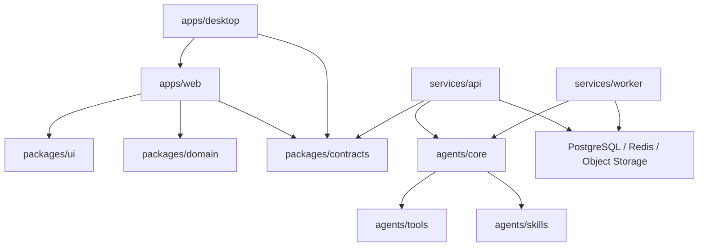

# OpenMathModel 项目结构

## 结构总览

```text
OpenMathModel/
├─ apps/                       # 用户直接使用的客户端
│  ├─ web/                    # React Web 产品
│  └─ desktop/                # Tauri 桌面壳与本地能力
├─ services/                  # 可独立部署的后端进程
│  ├─ api/                    # HTTP/事件流控制面
│  └─ worker/                 # 数据、实验、导出等长任务执行器
├─ agents/                    # 数学建模 Agent 领域实现
│  ├─ core/                   # 状态、节点、编排与上下文
│  ├─ skills/                 # 可组合建模技能
│  ├─ tools/                  # 文件、Python、检索、绘图等工具适配器
│  ├─ prompts/                # 可版本化提示模板
│  └─ evals/                  # Agent 轨迹与答案质量评测
├─ packages/                  # 跨应用共享、不可独立部署的包
│  ├─ ui/                     # 设计系统和通用组件
│  ├─ contracts/              # OpenAPI、JSON Schema、事件协议
│  ├─ domain/                 # 前端领域模型与纯业务规则
│  └─ config/                 # TS、Lint、格式化等共享配置
├─ datasets/                  # 数据目录规范、样例、清单和处理配方
│  ├─ catalog/                # 可提交的数据集元数据
│  ├─ samples/                # 小型脱敏样例
│  ├─ recipes/                # 下载、校验、清洗与切分脚本/声明
│  ├─ raw/                    # 本地原始数据，不提交
│  ├─ interim/                # 中间数据，不提交
│  └─ processed/              # 可训练/实验数据，不默认提交
├─ tests/                     # 跨模块集成、契约和端到端测试
│  ├─ contract/
│  ├─ integration/
│  ├─ e2e/
│  └─ fixtures/
├─ infra/                     # Docker、部署、监控和数据库基础设施
│  ├─ docker/
│  ├─ migrations/
│  ├─ deploy/
│  └─ observability/
├─ tools/                     # 仓库维护、生成、检查和发布脚本
├─ docs/                      # 产品、架构、ADR、开发和运维文档
├─ audit-current/             # UI 审计、React 迁移证据与原型归档
├─ references/                # 当前参考资料
└─ img/                       # 当前品牌/设计素材
```

## Workspace 根

仓库根同时是两套包管理器的 workspace 根，目录树本身不因语言而重新分组（见 [ADR-0003](./docs/adr/0003-workspace-roots.md)）：

| 文件 | 作用 |
|---|---|
| `pyproject.toml` | uv workspace 虚拟根，登记 Python member 并托管共享 ruff / mypy / pytest 配置 |
| `.python-version` | 统一解释器版本 |
| `package.json` | npm workspaces 根，当前仅含 `apps/web` |
| `.npmrc` | npm 配置；member 内的 `.npmrc` 会被 npm 忽略，所以统一放在根 |

Python member 使用 src 布局，发行名 `omm-*`、导入名 `omm_*`：`packages/contracts`、`agents/{core,skills,tools,evals}`、`services/{api,worker}`。`agents/prompts` 是模板资源，`datasets/recipes` 是独立脚本，二者都不是 member。

## 模块职责与依赖方向



依赖规则：

1. `apps/*` 只通过协议调用服务，不导入后端内部模块。
2. `services/api` 负责控制面与权限，不直接执行耗时建模代码。
3. `services/worker` 负责执行面；每次运行都写入事件、日志、指标和产物清单。
4. `agents/core` 不依赖 FastAPI、Tauri 或具体 UI，便于测试和嵌入。
5. `agents/tools` 中的高风险/高成本能力通过统一执行接口调用，不能散落在 prompt 中。
6. `packages/contracts` 是跨语言事实来源；协议先于调用方变更。
7. 大型数据与运行产物进入对象存储，本仓库只保存 manifest、样例和 recipe。
8. 上图中 `agents/core` 指向 tools/skills 的箭头表示运行时调用关系。包级导入方向相反：tools 与 skills 依赖内核并实现其端口，内核不反向依赖它们（见 ADR-0003）。

## Agent 内部分层

一个建模任务建议使用以下显式状态：

```text
CREATED -> PROBLEM_ANALYSIS -> DATA_PREPARATION -> MODEL_PLANNING
        -> EXPERIMENTING -> VALIDATING -> PAPER_WRITING -> COMPLETED
                                      \-> NEEDS_REVIEW
                                      \-> FAILED
```

核心对象：

- `Project`：一个持续存在的建模项目。
- `TaskRun`：一次可暂停、恢复、重放的 Agent 运行。
- `StepRun`：状态机中单个步骤的执行记录。
- `DatasetVersion`：带校验和、schema、血缘的数据快照。
- `ExperimentRun`：代码、环境、参数、随机种子和指标的不可变记录。
- `Artifact`：图表、模型、日志、Notebook、论文等交付物。
- `AgentEvent`：供 Web/Tauri 实时呈现的统一事件信封。

## 产品边界

### Web

- 项目与任务管理
- Agent 对话和计划确认
- 数据表格、模型方案、实验结果和论文编辑器
- 实时事件、人工确认、失败重试与产物下载

### Desktop

- 复用 Web 产品界面，不复制业务组件
- 本地工作区、文件系统选择器、系统密钥库
- 本地 Python/容器执行桥接与离线模式
- 自动更新、崩溃报告和桌面通知

### API 与 Worker

- API：认证、RBAC、项目元数据、任务控制、事件订阅、签名上传
- Worker：数据画像、特征工程、模型实验、图表渲染、文档导出
- 所有长任务使用幂等 job；API 只排队并返回 `run_id`

## 文件命名约定

- TypeScript：组件 `PascalCase.tsx`，其他模块 `kebab-case.ts`。
- Python：包和模块使用 `snake_case`，测试使用 `test_*.py`。
- Prompt：`<stage>.<variant>.prompt.md`，头部保存版本和输入/输出 schema。
- Dataset：`<dataset>/<version>/manifest.yaml`，数据文件不依赖“最新版”路径。
- ADR：`docs/adr/NNNN-short-title.md`。

## 暂不做的拆分

MVP 阶段不要把认证、数据集、实验、论文分别拆成微服务。先保持 `api + worker` 两个部署单元；当吞吐量、权限边界或团队所有权出现真实差异后再拆分。
