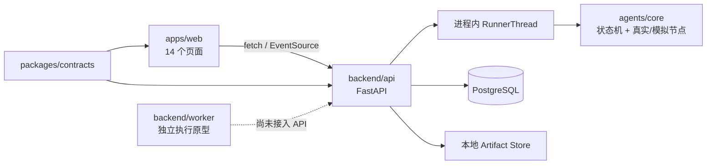
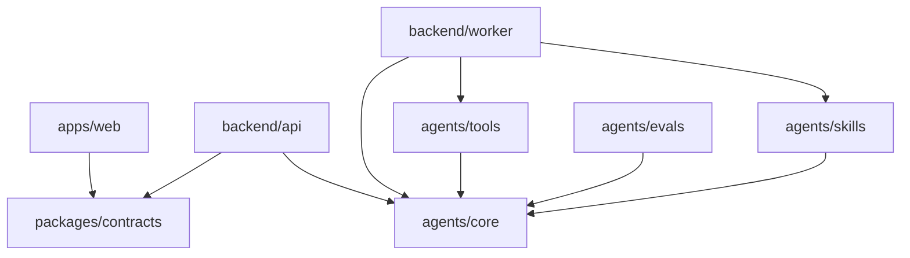
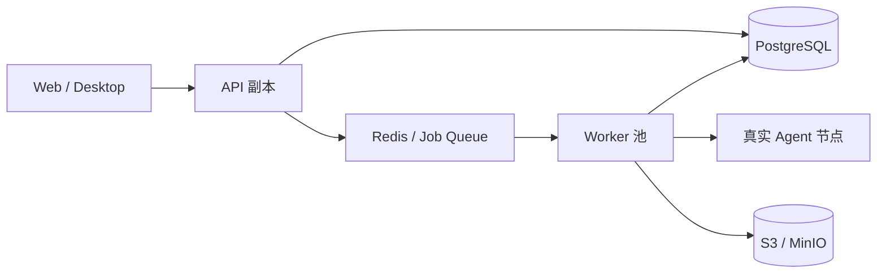

# OpenMathModel 项目结构

> 当前事实基线：2026-09-02。本文描述工作树中的实际目录、运行关系和依赖入口；目标部署形态单独标记。历史目录决策见 [ADR-0003](./docs/adr/0003-workspace-roots.md) 与 [ADR-0005](./docs/adr/0005-backend-directory.md)。

## 结构总览

```text
OpenMathModel/
├─ apps/
│  ├─ web/                    # React + TypeScript + Vite，当前 14 个产品页面
│  └─ desktop/                # Tauri 桌面端说明与后续入口
├─ backend/
│  ├─ api/                    # FastAPI 控制面；当前也承载进程内 RunnerThread
│  └─ worker/                 # 独立执行面原型，尚未接入 API 请求链
├─ agents/
│  ├─ core/                   # 状态机、事件、端口与回放
│  ├─ skills/                 # 结构化建模技能
│  ├─ tools/                  # 工作区、文件与 Python 执行适配器
│  ├─ prompts/                # 版本化 Prompt 资源
│  └─ evals/                  # Agent 轨迹与质量评测
├─ packages/
│  ├─ contracts/              # OpenAPI、JSON Schema、Python/TypeScript 类型
│  ├─ config/                 # npm workspace 中的共享配置包
│  ├─ domain/                 # 前端领域模型预留目录
│  └─ ui/                     # 共享 UI 预留目录
├─ datasets/                  # 来源清单、样例、Recipe 与本地数据分区
├─ infra/                     # PostgreSQL、Redis、MinIO 与部署配置
├─ tools/                     # 启动、生成、校验和仓库维护脚本
├─ docs/                      # 当前规范、ADR、路线图与历史验证快照
└─ tests/                     # 仓库级测试目录；本地治理规则禁止提交
```

`audit-current/`、`references/`、`doc/`、`tests/` 与根 `AGENTS.md` 是本地开发或治理内容，按仓库规则不进入正式提交。正式产品文档位于 `docs/`。

## Workspace 根

仓库根同时管理 npm 与 Python workspace：

| 入口 | 当前事实 |
|---|---|
| `package.json` | npm workspaces 当前登记 `apps/web`、`packages/config`、`packages/contracts` |
| `package-lock.json` | 根 npm 锁文件；依赖安装从仓库根执行 |
| `pyproject.toml` | uv workspace 虚拟根，登记 Contracts、四个 Agent 包、API 与 Worker |
| `.python-version` | Python workspace 的版本基线 |

Python 发行名使用 `omm-*`，导入名使用 `omm_*`。`packages/contracts`、`agents/{core,skills,tools,evals}` 与 `backend/worker` 使用 `src/` 布局；`backend/api` 当前直接以 `backend/api/omm_api` 作为包目录。文档和命令应遵循实际布局，不假定所有 member 都采用同一种目录层级。

`agents/prompts` 是资源目录，`datasets/recipes` 是独立脚本目录，二者都不是 Python workspace member。

## 当前运行架构



当前边界：

1. Web 通过同源 `/api` 代理调用 API；首页/确认页已创建真实 Project/TaskRun，账户、运行快照、审批（G1 方案门 / G2 数据闸门 / 完成后修订门）、SSE、附件上传与文本抽取（扫描件走远程 OCR）、五类阶段正文投影与论文导出均已接线。
2. API 既负责 HTTP 控制面，也由进程内 `RunnerThread` 推进六阶段工作流。
3. API 使用 PostgreSQL（默认连 `tools/pg-dev.ps1` 的本地 5433 实例）和本地内容寻址 Artifact Store。
4. `backend/worker` 已有文件队列、租约、事件日志和隔离执行能力，但 API 当前没有导入或调度 `omm_worker`。
5. 配置了自定义 API 的用户，六个建模阶段全部由 `agents/skills` 真实节点执行，实验阶段经 `agents/tools` 的 python 沙箱运行生成代码；未配置或提示词缺失时整链回落 `SimStageNode` 模拟节点。

详细事实来源见[系统架构](./docs/architecture/system-overview.md)和[前后端与 Agent 工作台对接规范](./docs/development/frontend-backend-agent-integration.md)。

## 当前依赖方向



约束：

1. `apps/*` 通过协议调用后端，不导入 `backend/*` 内部模块。
2. `packages/contracts` 是跨语言协议事实来源；Schema 变更先于调用方变更。
3. `omm-agent-core` 保持框架无关，并位于 Agent 包级依赖底层。
4. Tools 与 Skills 实现 Core 定义的端口；运行时由执行入口装配。
5. UI 不从 Agent 日志自然语言反向解析表格、指标或论文正文。
6. 大型数据和运行产物进入本地/对象存储，仓库只保存清单、样例和 Recipe。

## API、Runner 与 Worker 的职责

| 单元 | 当前职责 | 下一阶段职责 |
|---|---|---|
| `backend/api` | 鉴权、项目、TaskRun、审批、事件、Artifact、工作台与阶段正文投影；进程内 Runner 推进六阶段节点（配置模型后为真实节点，否则模拟） | 保持控制面协议稳定，把长任务调度移交独立执行面 |
| `RunnerThread` | 本地开发中轮询并推进一次阶段 tick | 在独立 Worker 接线后退出生产执行路径 |
| `backend/worker` | 可独立验证的队列、租约、事件恢复、沙箱与产物原型 | 消费 API 发布的幂等任务并运行真实 Agent 节点 |
| `agents/core` | 状态机、领域事件、回放和执行端口 | 继续作为 API 与 Worker 共享的框架无关内核 |

因此，“API 只排队、Worker 执行全部长任务”是目标边界，不是当前运行事实。

## 数据与存储

| 场景 | 当前默认 | 目标部署 |
|---|---|---|
| 元数据与领域事件 | PostgreSQL（限定；SQLite 仅测试夹具） | PostgreSQL |
| 运行推进 | API 进程内 RunnerThread | 独立 Worker + 队列 |
| Artifact 二进制 | 本地内容寻址目录 | S3 兼容对象存储 |
| 实时页面通知 | 数据库事件表 + SSE | 持久事件 + 可扩展通知通道 |

数据库限定 PostgreSQL：代码默认连 `tools/pg-dev.ps1` 的免安装本地实例（port 5433），Docker 底座（port 5432）经 `OMM_DATABASE_URL` 覆盖，schema 以 Alembic 为准；SQLite 仅作为测试夹具的临时隔离库保留（完整 API 测试套件在两种方言上均通过）。Redis 和 MinIO 仍仅用于兼容性验证。

## Agent 状态与页面

当前 TaskRun 领域阶段：

```text
CREATED → PROBLEM_ANALYSIS → DATA_PREPARATION → MODEL_PLANNING
        → EXPERIMENTING → VALIDATING → PAPER_WRITING → COMPLETED
```

运行生命周期 `QUEUED/RUNNING/WAITING_APPROVAL/PAUSED/COMPLETED/FAILED/CANCELLED` 与领域阶段是两条独立轴。`ModelingWorkspaceView` 把两条轴投影到现有六个流程页面；它当前驱动项目名、Agent 时间线、摘要、动作、阶段状态和 Artifact 文件行。右侧指标、图表、方案正文和论文内容多数仍来自页面模板，等待独立页面正文契约。

## 目标部署架构

目标态保持协议和页面不变，只替换执行与存储端口：



MVP 阶段维持 `api + worker` 两个部署单元；只有吞吐量、权限边界或团队所有权形成明确差异时再评估服务拆分。

## 文件命名约定

- TypeScript：组件 `PascalCase.tsx`，其他模块 `kebab-case.ts`。
- Python：包和模块使用 `snake_case`，测试使用 `test_*.py`。
- Prompt：`<stage>.<variant>.prompt.md`，头部保存版本和输入/输出 Schema。
- Dataset：`<dataset>/<version>/manifest.yaml`，数据文件不依赖“最新版”路径。
- ADR：`docs/adr/NNNN-short-title.md`。
