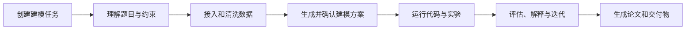

# OpenMathModel

面向数学建模全流程的 Agent 产品。产品覆盖题目理解、数据处理、模型构建、实验运行、结果解释、论文写作与项目复现，并同时提供 Web 与 Tauri 桌面端。

## 当前状态

- `apps/web/`：由原静态原型迁移完成的 React + Vite 前端，覆盖 14 个产品页面。
- `audit-current/`：原型审计、React 迁移截图、对照证据与迁移前源码归档。
- `references/`、`img/`：现有参考资料和品牌素材。
- 产品工程骨架已经按“应用 / 服务 / Agent / 共享包 / 数据 / 基础设施”拆分，详见 [PROJECT_STRUCTURE.md](./PROJECT_STRUCTURE.md)。

## 产品主流程

## 目标技术栈

| 层 | 建议技术 | 说明 |
|---|---|---|
| Web | React + TypeScript + Vite | 产品 UI、流式任务状态、编辑器与可视化 |
| Desktop | Tauri 2 + Rust | 复用 Web UI，提供本地文件、Python 环境和系统能力 |
| API | Python + FastAPI | 认证、项目、任务、数据集、产物和 Agent 控制面 |
| Worker | Python worker | 隔离执行长任务、模型实验、文档导出和数据处理 |
| Agent | Python，显式状态机 | 编排、技能、工具、记忆、评估与安全执行边界 |
| Storage | PostgreSQL + Redis + S3/MinIO | 元数据、事件/队列、数据集和任务产物 |
| Contract | OpenAPI + JSON Schema | Web、桌面端、API、Agent 之间的稳定协议 |

## 目录入口

- [系统架构](./docs/architecture/system-overview.md)
- [产品路线图](./docs/product/roadmap.md)
- [仓库结构与边界](./PROJECT_STRUCTURE.md)
- [数据集规范](./datasets/README.md)
- [ADR-0001：Monorepo 边界](./docs/adr/0001-monorepo-boundaries.md)

## 开发顺序

1. 在 `packages/contracts` 定义任务、事件、产物和数据集协议。
2. 将 `apps/web` 的模拟数据接入任务与事件协议。
3. 实现 `services/api` 的项目/任务 API 与 SSE/WebSocket 事件流。
4. 实现 `agents/core` 状态机，并由 `services/worker` 执行具体步骤。
5. 接入对象存储和可复现实验工作区，再封装 `apps/desktop`。

> 原 `demo/` 已在 React 迁移验收后移除；视觉证据与迁移前源码归档位于 `audit-current/`。
