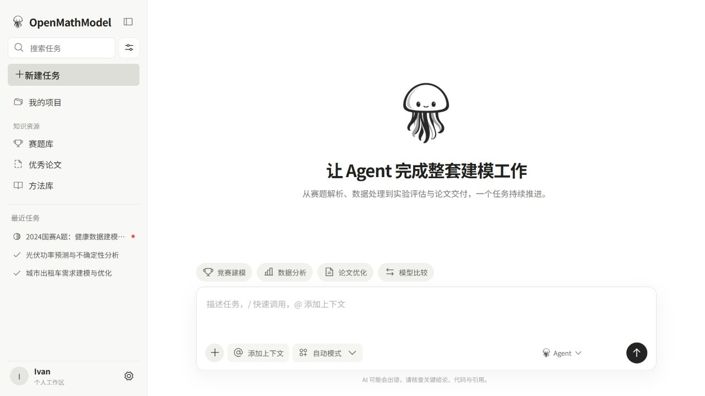
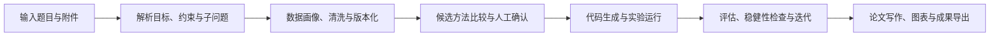
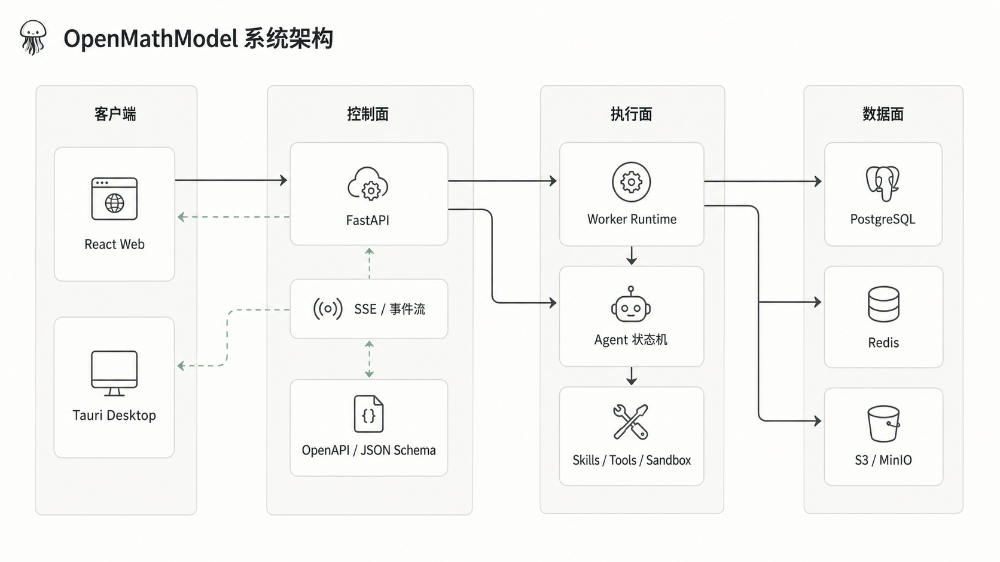

# OpenMathModel

面向数学建模全流程的 Agent 工作台：从读题、数据处理和模型实验，一路推进到结果解释、论文写作与可复现交付。

> [!IMPORTANT]
> 项目仍在持续开发中。当前 14 个 Web 页面及其视觉、布局和交互是产品界面基线；后续开发只在现有页面中接入真实数据，不另建替代页面。登录与账号安全已有 API 对接，项目、任务、步骤、审批、SSE 事件和 Artifact API 已实现；建模主流程的页面级数据绑定仍在按契约逐步接入。

## 产品预览



## 为什么是 OpenMathModel

- **一条任务贯穿全流程**：题目理解、数据准备、方案比较、代码实验、稳健性验证、论文撰写和成果导出不再散落在多个工具里。
- **Agent 过程可见、可控**：使用显式状态机推进任务，支持人工确认、暂停、恢复、重试和事件回放。
- **实验可复现**：数据版本、参数、随机种子、指标、日志和产物都纳入统一运行记录。
- **专业知识可复用**：赛题库、优秀论文库、方法库和数据 Recipe 为后续任务提供结构化上下文。
- **面向本地与云端**：Web、API 和 Worker 已有工程实现，桌面端按 Tauri 2 + 本地执行桥接方向建设。

## 当前实现

| 模块 | 状态 | 已有能力 |
|---|---|---|
| Web | 可运行 | React + TypeScript + Vite，使用现有路由表、页面模板和 DOM 适配器承载 14 个产品页面；首页发送已真实创建 Project/TaskRun 并传播 `run_id`（`/confirm` 为直接访问的草稿复核入口），工作台状态、审批、SSE 与 Artifact 元数据已原位接通；阶段正文和论文保存仍按契约推进 |
| API | 可运行 | FastAPI、SQLAlchemy 2、Alembic、会话鉴权、项目与任务、动作幂等、SSE 事件、Artifact 校验与下载 |
| Agent | 六阶段真实节点已接线 | 显式状态机、领域事件、回放恢复；配置自定义 API 后题意解析、数据准备、建模方案、实验（python 沙箱执行生成代码）、检验、论文六阶段全部走真实 LLM 节点，未配置时回落模拟链路 |
| Worker / Tools | 独立原型已验证 | 文件队列、租约、事件日志、隔离工作区、工具允许列表和 Python 子进程执行；当前尚未由 API 调度 |
| Contracts | 可校验与生成 | OpenAPI + JSON Schema，生成 Python 模型与 TypeScript 类型，提供兼容性检查 |
| Data | 管线已建立 | 来源注册、采集、校验、内容寻址、结构化题面与前端知识库快照 |
| Desktop | 设计与骨架阶段 | 规划复用 Web UI，补充本地文件、密钥库、Python sidecar、离线模式和桌面通知 |

## 建模主流程



## 快速开始

### 1. 首次安装

前置条件：Node.js `>= 20`、npm、Python `3.12`。

```powershell
git clone git@github.com:IvanCodesDev/OpenMathModel.git
cd OpenMathModel
npm install
py -3.12 -m venv .venv
.venv\Scripts\python -m pip install -e packages/contracts -e agents/core -e agents/harness -e agents/skills -e agents/tools -e "backend/api[dev]"
```

### 2. 启动完整联调（推荐）

登录、账户设置和建模工作台都依赖 API。推荐从仓库根运行统一入口：

```powershell
npm run dev
```

该命令启动或复用 `127.0.0.1:8000` 的 API，等待健康检查成功，再启动 Web 开发服务器。浏览器地址以终端输出为准，默认为 [http://localhost:5183](http://localhost:5183)（本项目固定端口，避免与其他本地 Vite 项目挤占默认 5173）。

启动后可单独确认 API：

```powershell
Invoke-RestMethod http://127.0.0.1:8000/api/health
```

预期返回包含 `status: ok` 的对象。

`npm run dev:web` 只启动 Vite。它适合查看无需后端的静态模板；若单独使用，登录和工作台 API 请求需要另一个终端先启动 API。

### 3. 手动双终端启动

统一入口诊断时可分别启动两个进程：

```powershell
# 终端 A：API（--timeout-graceful-shutdown 必带：页面的 SSE 长连接永不排空，
# 不设上限时 --reload 的优雅停机会无限等待，表现为改代码后 API 失联）
.venv\Scripts\python -m uvicorn omm_api.asgi:app --app-dir backend/api --reload --timeout-graceful-shutdown 5 --port 8000

# 终端 B：Web
npm run dev:web
```

默认使用本地 SQLite，无需先启动数据库服务。API 文档位于 [http://127.0.0.1:8000/docs](http://127.0.0.1:8000/docs)，完整配置见 [`backend/api/README.md`](./backend/api/README.md)。

### 4. 用真实 `run_id` 验证工作台

以下 PowerShell 流程复用 Cookie 会话，依次完成登录、创建 Project、创建 TaskRun 和读取工作台快照。先在 Web 注册一个未启用 2FA 的开发账户，再替换示例邮箱与密码：

```powershell
$base = "http://127.0.0.1:8000"
$web = "http://localhost:5183" # 若 Vite 选择了其他端口，替换为终端输出地址
$login = Invoke-RestMethod `
  -Method Post `
  -Uri "$base/api/auth/login" `
  -ContentType "application/json" `
  -Body (@{ email = "developer@example.com"; password = "Passw0rd123" } | ConvertTo-Json) `
  -SessionVariable session

$project = Invoke-RestMethod `
  -Method Post `
  -Uri "$base/api/v1/projects" `
  -ContentType "application/json" `
  -Body (@{ name = "本地联调项目" } | ConvertTo-Json) `
  -WebSession $session

$run = Invoke-RestMethod `
  -Method Post `
  -Uri "$base/api/v1/task-runs" `
  -Headers @{ "Idempotency-Key" = "dev-$([guid]::NewGuid())" } `
  -ContentType "application/json" `
  -Body (@{ project_id = $project.id; goal = "完成一次本地建模联调" } | ConvertTo-Json) `
  -WebSession $session

$workspace = Invoke-RestMethod `
  -Uri "$base/api/v1/task-runs/$($run.id)/workspace" `
  -WebSession $session

$run.id
$project.id
$workspace | Select-Object run_status, active_node, suggested_route
"$web/task/running?run_id=$($run.id)&project_id=$($project.id)"
```

随后在已登录同一账户的浏览器中打开最后一行输出的 URL。

这条 API 流程用于独立诊断登录、Project、TaskRun 与 workspace 契约。产品页面中的“首页输入 → 发送（登录续接）→ 创建运行 → 任务执行页”也已使用同一组接口，`/confirm` 保留为直接访问时的草稿复核入口；附件在当前切片只保存名称、大小和媒体类型等元数据，文件上传与解析在后续阶段接入。

### 5. 构建与检查

```powershell
npm run check
npm run build
```

### 6. 启动开发基础设施（可选）

PostgreSQL、Redis 与 MinIO 用于目标部署兼容性验证，并非默认 SQLite 联调的前置条件。安装 Docker Desktop 或兼容 Docker Compose v2 的运行时后：

```powershell
.\tools\dev-up.ps1
.\tools\verify-dev-stack.ps1
```

这会启动 PostgreSQL（pgvector）、Redis 和 MinIO。端口、凭据与关闭方式见 [`infra/README.md`](./infra/README.md)。

## 系统架构



_架构图同时呈现当前模块和演进方向；当前实际调用链以文字说明与[系统架构](./docs/architecture/system-overview.md)为准。_

当前 API 使用进程内 `RunnerThread`、SQLite 和本地 Artifact Store。独立 Worker、PostgreSQL、队列与 S3 兼容存储是目标部署方向；Agent 内核保持框架无关，跨模块协议由 Contracts 统一约束。

## 仓库导航

| 路径 | 职责 |
|---|---|
| [`apps/web`](./apps/web) | React Web 产品与 14 个页面 |
| [`apps/desktop`](./apps/desktop) | Tauri 桌面端入口与原生能力边界 |
| [`backend/api`](./backend/api) | HTTP、鉴权、任务控制、事件与 Artifact API |
| [`backend/worker`](./backend/worker) | 队列、租约、事件日志与隔离执行原型；尚未接入 API 调度 |
| [`agents`](./agents) | Agent 内核、技能、工具、Prompt 与评测 |
| [`packages/contracts`](./packages/contracts) | OpenAPI、JSON Schema 和跨语言生成类型 |
| [`datasets`](./datasets) | 数据集目录规范、采集 Recipe、Schema 与样例 |
| [`infra`](./infra) | 本地开发基础设施、部署和可观测性 |
| [`docs`](./docs) | 架构、ADR、实现记录与产品路线图 |

更完整的目录与依赖边界见 [`PROJECT_STRUCTURE.md`](./PROJECT_STRUCTURE.md)。

## 开发校验

```powershell
# Web：类型检查、Lint 与生产构建
npm run check
npm run build

# API 测试
.venv\Scripts\python -m pytest backend/api/tests -q

# 契约自检与生成物一致性
.venv\Scripts\python packages/contracts/validate.py
.venv\Scripts\python packages/contracts/check_compat.py
.venv\Scripts\python packages/contracts/scripts/generate_python.py --check
```

GitHub Actions 还会校验 Web、Python、Agent 运行时与生成的 TypeScript 契约。

## 进一步阅读

- [开发文档总览](./docs/README.md)
- [Web 页面基线与前后端对接规范](./docs/development/web-ui-baseline-and-api-integration.md)
- [系统架构](./docs/architecture/system-overview.md)
- [产品路线图](./docs/product/roadmap.md)
- [仓库结构与依赖边界](./PROJECT_STRUCTURE.md)
- [数据集与采集规范](./datasets/README.md)
- [开发基础设施](./infra/README.md)
- [ADR-0001：Monorepo 边界](./docs/adr/0001-monorepo-boundaries.md)
- [ADR-0006：保留现有 Web 界面并原位接入 API](./docs/adr/0006-preserve-web-ui-and-integrate-api.md)
