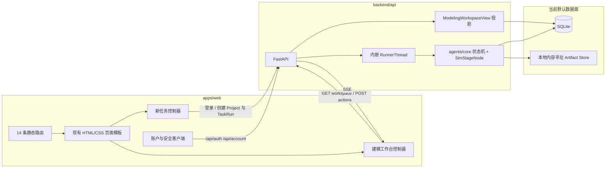
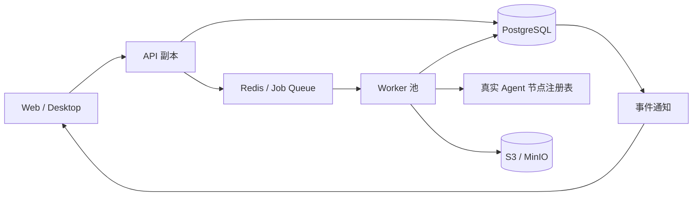

# 系统架构

> 状态基线：2026-08-11。本文明确区分“当前运行架构”“独立执行面原型”和“目标部署架构”，避免把规划写成已实现事实。

## 1. 设计目标

- **可恢复**：任务可暂停、审批、重试，并可由事件历史恢复 UI 状态。
- **可复现**：实验最终要绑定数据、代码、环境、参数、随机种子和指标。
- **可追溯**：Agent 阶段、审批、产物和论文结论有统一运行身份。
- **界面稳定**：后端语义进入现有 14 个 Web 页面，不以对接为由重做界面。
- **本地优先、可演进**：本地 SQLite 与内容存储先可用，再平滑替换为服务化底座。

## 2. 当前物理架构



当前事实：

1. Web 继续由 `App.tsx` 的路径映射、`OpenMathModelScreen` 和 `openmathmodel-ui.ts` 生成页面。
2. 首页通过 `task-start-controller.ts` 保存草稿，发送时恢复登录并直接创建真实 Project/TaskRun，把 `run_id/project_id` 交给执行页；`/confirm` 是直接访问时的草稿复核入口，共用同一套提交流程。当前附件只传播元数据。账户与安全页面使用正式 API。
3. 六个建模流程页面都会挂载 `modeling-workspace-controller.ts`，仅在 URL 或同标签页 sessionStorage 提供合法运行身份时请求 workspace API。
4. `GET /api/v1/task-runs/{run_id}/workspace` 聚合运行、步骤、待审批项和产物，作为 Agent 左栏与阶段页面状态的共同语义来源；它当前不提供右侧详细正文。
5. Web 首屏取快照，随后订阅 SSE；阶段或产物事件触发快照刷新。
6. API 默认使用 SQLite、本地 Artifact Store 和进程内 `RunnerThread`。
7. API 当前执行节点仍是 `SimStageNode`。生产接线尚未替换为完整的真实技能节点。

完整的前后端与 Agent 映射见[前后端与 Agent 工作台对接规范](../development/frontend-backend-agent-integration.md)。

## 3. 当前浏览器主链：新任务创建与工作台恢复

当前浏览器主链已经从首页输入延伸到真实 TaskRun：

```text
首页输入与附件元数据
  → sessionStorage TaskDraft
  → 发送：fetchMe / 现有登录模态续接
  → POST /api/v1/projects
  → POST /api/v1/task-runs（稳定 Idempotency-Key）
  → /task/running?run_id=...&project_id=...
```

`/confirm` 不在首页发送链路上：直接访问时恢复草稿复核，“开始任务”执行同一套提交流程；无草稿时进入显式 `demo=1`，不创建后端资源，也不复用旧 `activeRunId`。API 或身份错误停留在当前页（首页或确认页）并原位显示状态；重新发送未修改的草稿沿用已写回的 `project_id` 与幂等 token，不重复创建。

工作台恢复切片随后以**后端返回的 `run_id`** 为起点，覆盖工作台快照、Agent 时间线与摘要、模型方案审批、SSE 刷新，以及实验/完成页的真实 Artifact 文件清单。它仍不包含五类页面详细正文契约、附件文件上传/解析、数据清洗确认/采用实验结果/论文交付等业务动作、可见的暂停入口、独立 Worker 和完整 Skills 的生产接线。

```text
URL run_id
  → GET /api/v1/task-runs/{run_id}/workspace
  → ModelingWorkspaceView
  → 现有页面 DOM 适配器
      ├─ 顶部项目名与运行状态
      ├─ 左侧 Agent 时间线、摘要和主操作
      ├─ 右侧阶段状态
      └─ 实验/完成页 Artifact 文件行
  → EventSource /events?after=<latest_sequence>
  → 事件到达后重新获取快照
```

运行身份的实际解析顺序是：URL 显式 `demo=1` 时优先进入演示状态；否则，URL 中存在且格式合法的 `run_id` 优先并写入 `sessionStorage`，URL 未提供 `run_id` 时才读取同一标签页中合法的 `sessionStorage.openmathmodel.activeRunId`。URL 显式提供非法值，或两处都没有合法值时进入 demo 状态并且不请求 workspace API。

`suggested_route` 是导航建议，不是命令。用户打开的流程页与 `active_page` 不一致时，控制器仍在当前页面渲染同一快照，并把主操作降为“前往当前阶段”；只有用户点击后才跳转。错页加载本身不提交 `/actions`，也不推进、审批或改变 TaskRun 状态。

审批链路已经闭环：

```text
MODEL_PLANNING
  → ApprovalRequest(PENDING)
  → workspace.agent.action(kind=approve)
  → Web POST /actions（Idempotency-Key）
  → approval.resolved / run.node_changed SSE
  → workspace 快照刷新
  → Agent 时间线与主操作同步更新
```

事件是增量通知，快照是页面恢复依据。Web 不从 `run.log` 自然语言拼装表格或论文。

## 4. 独立执行面原型

`backend/worker` 已具备文件队列、租约、JSONL 事件恢复、沙箱和工作区产物能力，但当前 API 未导入或调度 `omm_worker`。它是下一阶段执行面原型，不是当前 API 请求链的一部分。

同样，`agents/skills` 中已有的真实题意分析和方案规划能力还没有替换 API 的全部 `SIM_NODES`。因此文档和 UI 必须把模拟阶段产物标识为模拟，不把它描述为完整生产智能体。

## 5. 数据与事实来源

| 数据 | 当前事实来源 | Web 消费方式 |
|---|---|---|
| 运行生命周期 | `task_runs` | `ModelingWorkspaceView.run_status/active_node` |
| 阶段尝试 | `step_runs` | `pages[].status` 聚合结果 |
| 审批 | `approval_requests` | `pending_approval` 与 `agent.action` |
| 实时通知 | `agent_events` | SSE，`sequence` 单调递增 |
| 文件元数据 | `artifacts` | `artifacts[]` 与下载 URL |
| 二进制内容 | 本地 Blob Store | `/api/v1/artifacts/{id}/download` 下载时校验 SHA-256 |
| 用户头像 | `users.avatar_sha256` + 独立头像内容存储 | `user.avatar_url` 带摘要查询串，`/api/account/avatar` 仅返回本人头像 |
| 页面详细正文 | 当前多数仍为模板数据 | 后续由版本化阶段输出契约替换 |

领域事件表是执行事实来源，控制面表和 `ModelingWorkspaceView` 是查询投影。UI 不直接读取数据库或 Worker 文件。

## 6. Agent 与页面边界

后端输出语义，前端拥有表现：

- 后端：阶段、状态、纯文本摘要、允许动作、审批 ID、产物引用。
- 前端：HTML、CSS、图标、页面标签、表格布局、编辑器和响应式行为。
- Agent 输出不携带 HTML、CSS 类名或 DOM 选择器。
- 同一 `ModelingWorkspaceView` 同时驱动 Agent 左栏和右侧页面，避免两个区域展示不同阶段。

节点到页面的当前映射：

| 节点 | 页面 |
|---|---|
| `CREATED` / `PROBLEM_ANALYSIS` | `/task/running` |
| `DATA_PREPARATION` | `/workspace/data` |
| `MODEL_PLANNING` | `/workspace/model-plan` |
| `EXPERIMENTING` / `VALIDATING` | `/workspace/experiments` |
| `PAPER_WRITING` | `/workspace/paper-editor` |
| `COMPLETED` | `/task/complete` |

## 7. API 边界

### 7.1 当前已实现

```text
GET  /api/health
POST /api/auth/*
GET/PATCH/POST/DELETE /api/account/*
GET/POST/DELETE       /api/account/avatar

POST/GET /api/v1/projects
GET      /api/v1/projects/{project_id}
POST/GET /api/v1/projects/{project_id}/artifacts

POST/GET /api/v1/task-runs
GET      /api/v1/task-runs/{run_id}
GET      /api/v1/task-runs/{run_id}/steps
GET      /api/v1/task-runs/{run_id}/approvals
POST     /api/v1/task-runs/{run_id}/actions
GET      /api/v1/task-runs/{run_id}/workspace
GET      /api/v1/task-runs/{run_id}/events/history
GET      /api/v1/task-runs/{run_id}/events

GET      /api/v1/artifacts/{artifact_id}/download
```

错误信封统一为 `code`、`message`、`request_id`、`details`。当前 TaskRun 创建与 TaskRun `/actions` 使用 `Idempotency-Key`；这不是对所有写接口的统一实现声明。受保护资源按项目 owner 隔离。

### 7.2 已实现的页面语义契约

`packages/contracts/schemas/v1/modeling-workspace-view.schema.json` 是工作台快照事实来源，生成 Python 与 TypeScript 类型。它包含：

- 运行与项目身份；
- 当前节点、当前页面、建议路由；
- Agent 状态、摘要、当前步骤和允许动作；
- 六个流程页面的状态与产物 ID；
- 带状态的产物元数据；只有 `READY` 且具有完整存储引用与哈希的 Artifact 才提供 `download_url`；
- 当前待审批项与最新事件序号。

### 7.3 下一批页面正文契约

工作台快照解决“当前在哪、Agent 显示什么、可以做什么、有哪些文件”，但不替代各阶段正文数据。以下契约仍需按顺序落地：

| 页面 | 下一契约 | 关键内容 |
|---|---|---|
| 数据准备 | `DatasetProfile` | 指标、问题、预览、清洗记录、字段字典 |
| 建模方案 | `PlanProposal` | 2–3 个角色化方案、假设、符号、实现计划 |
| 实验结果 | `ExperimentSummary` | 指标、图表、稳健性、运行环境、产物分组 |
| 论文编辑 | `DocumentDraft` | 版本、大纲、章节、引用、检查与乐观锁 |
| 最终成果 | `DeliveryManifest` | 摘要、限制、交付文件、哈希与一致性检查 |

在这些契约发布前，右侧详细指标和论文示例仍属于页面模板；不得从日志文本反向解析填充。

Artifact 投影是一份真实文件清单，而不是由前端生成的交付压缩包。`PENDING`、`STALE`、`DELETED` 仍可作为状态行显示，但下载按钮禁用；“导出文件清单”只导出名称、类型、状态、大小与下载地址的文本清单，不创建 ZIP 或合并归档。

## 8. 目标部署架构

目标态才使用下列链路：



迁移原则：先保持现有 API 与契约不变，再替换执行与存储端口；不以部署升级为由更换页面路由或视觉结构。

## 9. 当前关键缺口

1. API 与独立 Worker 尚未贯通。
2. 完整真实 Agent 节点尚未替换 `SimStageNode`。
3. `STEP_SUCCEEDED` 的结构化 outputs/metrics 尚未投影为版本化阶段输出。
4. 五类页面正文契约、论文保存与版本冲突处理尚未落地。
5. 新任务附件当前只进入 TaskRun 参数元数据；二进制上传、解析和 Artifact 血缘绑定尚未接通。
6. Artifact 血缘目前仍未完整投影。
7. 当前 API 自动化已经覆盖排队、待审批、完成态、完成页产物聚合、非 READY Artifact、跨项目异常关联、跨账户 404 与 OpenAPI 组件兼容；新任务状态纯函数已有 4 个用例。Web 控制器 DOM、真实登录后的创建链、SSE 重连、错页导航和非 READY Artifact 的浏览器自动化仍待补齐，现阶段已有关键流程的人工浏览器验收。

这些项是后续开发清单，不影响当前工作台状态、审批和产物元数据闭环的可用性。
