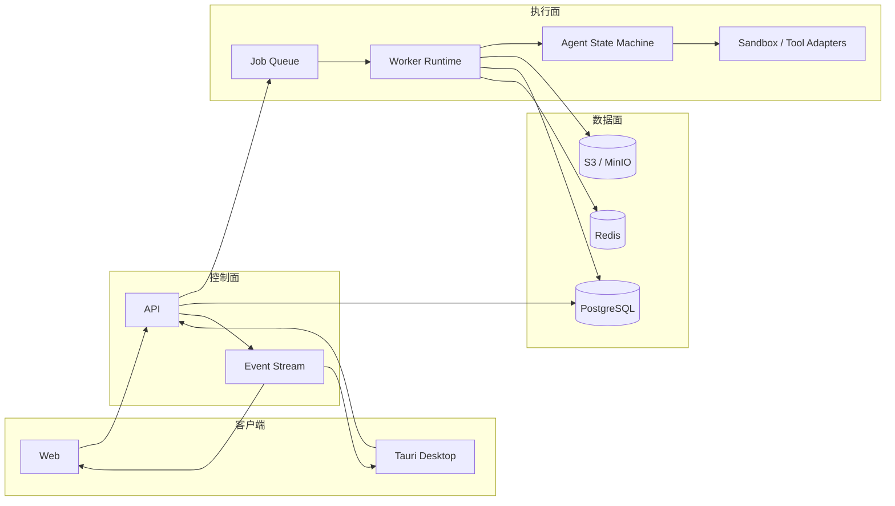

# 系统架构

## 1. 设计目标

- **可恢复**：Agent 任一步骤可以暂停、确认、重试和从事件日志恢复。
- **可复现**：每个实验绑定数据版本、代码版本、环境、参数、随机种子和指标。
- **可解释**：计划、工具调用、证据、图表和结论形成可审计链路。
- **双端一致**：Web 与桌面端共享 UI、领域模型和 API 合约。
- **本地优先可扩展**：桌面端支持本地数据/算力，云端支持团队协作和长任务。

## 2. 逻辑架构



## 3. 关键运行链路

1. 客户端创建 `TaskRun`，API 持久化初始状态并返回 `run_id`。
2. API 发布幂等 Job；Worker 按 `run_id + step_id + attempt` 获取执行锁。
3. Agent 状态机读取项目快照，生成结构化计划，必要时进入 `NEEDS_REVIEW`。
4. 工具适配器在隔离工作区内产生代码、日志、指标与 Artifact。
5. Worker 先写 Artifact/事件，再推进状态，避免 UI 看到不存在的产物。
6. 客户端通过 SSE（MVP）订阅事件；需要双向低延迟控制时再增加 WebSocket。

## 4. 数据与产物

| 类型 | 存储 | 原则 |
|---|---|---|
| 用户、项目、任务状态 | PostgreSQL | 事务一致、可查询 |
| 短期锁、限流、队列、热点状态 | Redis | 可丢失、可重建 |
| 原始数据、模型、图片、论文、日志包 | S3/MinIO | 内容寻址、版本化 |
| 实时事件 | PostgreSQL 事件表 + Redis 通知 | 数据库为事实来源 |
| 本地桌面工作区 | 用户文件系统 | manifest 与云端 Artifact 对齐 |

Artifact 推荐字段：`id`、`project_id`、`run_id`、`kind`、`uri`、`sha256`、`size`、`media_type`、`producer_step`、`created_at`。

## 5. Agent 设计约束

- 状态机节点只接收结构化上下文并输出结构化结果。
- Prompt、模型供应商和工具实现都通过端口注入，不成为领域逻辑。
- 每次工具调用记录输入摘要、输出摘要、耗时、成本、状态和 Artifact。
- 人工确认是正式状态转换，不在 UI 内做临时布尔判断。
- 代码执行使用每任务独立工作区、资源上限和允许列表。
- 数学结论需要链接到数据、实验指标或推导证据，不只保存自然语言答案。

## 6. API 边界（首批）

```text
/v1/projects
/v1/projects/{project_id}/datasets
/v1/projects/{project_id}/artifacts
/v1/task-runs
/v1/task-runs/{run_id}
/v1/task-runs/{run_id}/actions   # approve / pause / resume / cancel / retry
/v1/task-runs/{run_id}/events    # SSE
/v1/experiments
/v1/experiments/{experiment_id}
```

错误统一返回 `code`、`message`、`request_id`、`details`；异步动作返回任务状态而不是伪装成同步成功。

## 7. 部署阶段

- **本地开发**：Web + API + Worker + PostgreSQL + Redis + MinIO。
- **桌面单机**：Tauri + 本地 API/Worker sidecar + 本地对象目录。
- **云端 MVP**：静态 Web/CDN + API 副本 + Worker 池 + 托管数据服务。
- **规模化**：按任务类型拆 Worker 队列，而不是提前拆业务微服务。
