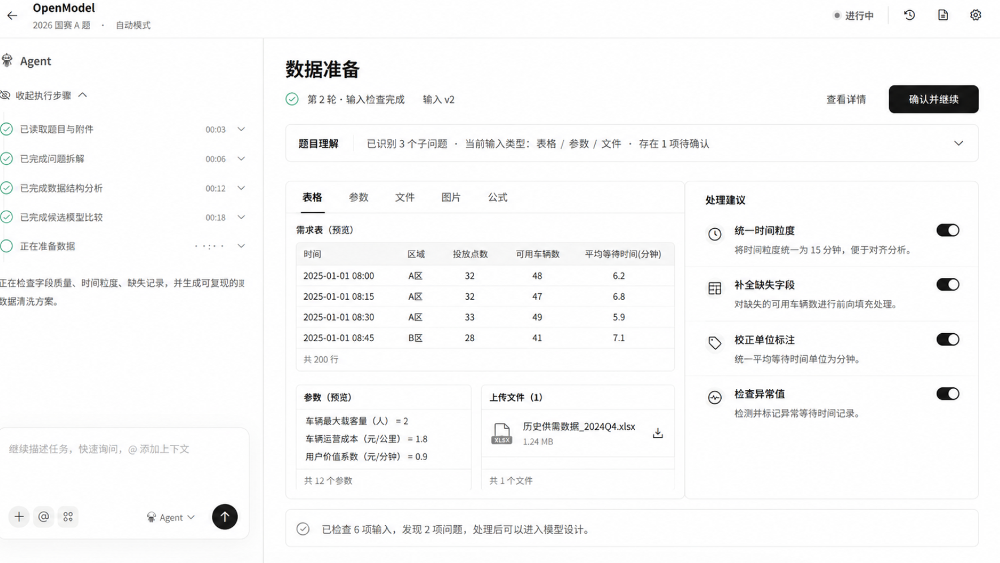
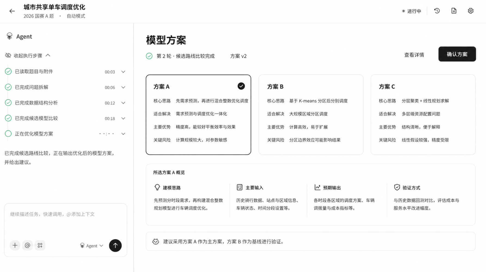
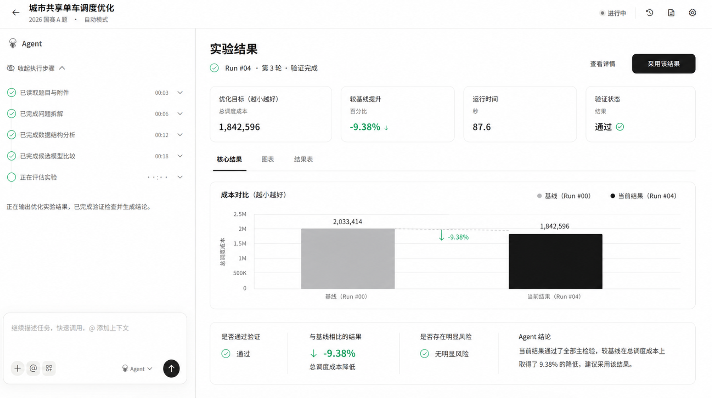
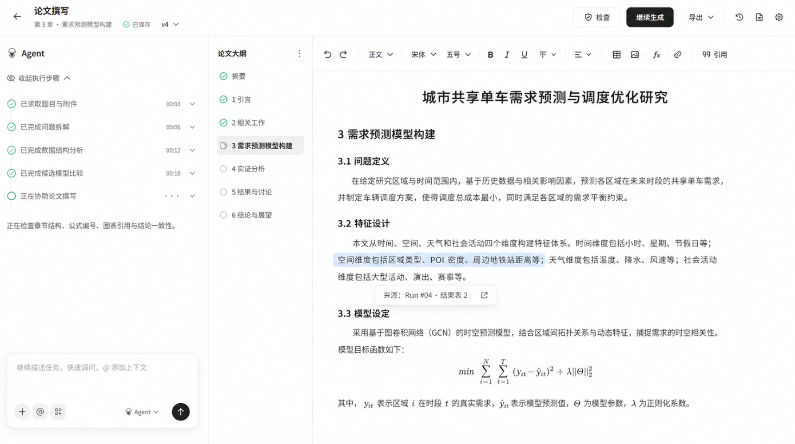
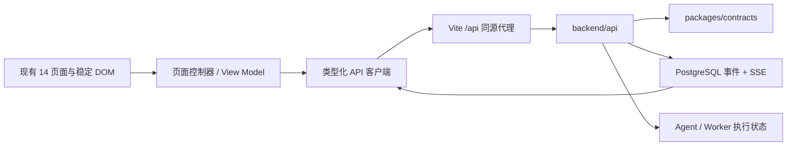
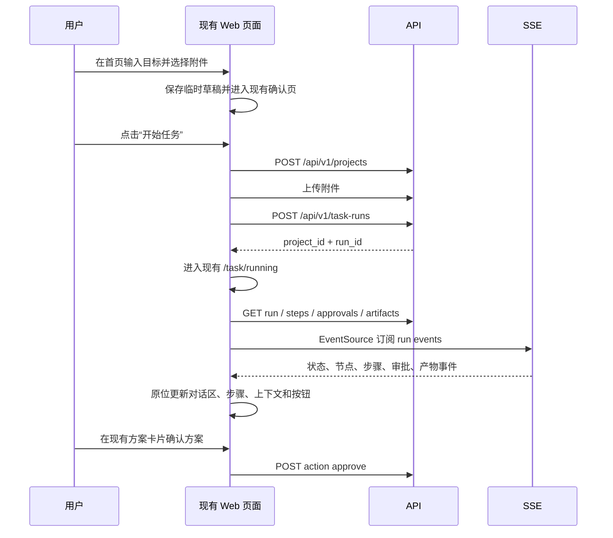

# Web 页面基线与前后端对接开发规范

- 状态：当前规范（Normative）
- 日期：2026-08-09
- 关联：ADR-0006、`packages/contracts`、`backend/api`

## 1. 一句话原则

**保留现在这套页面，把真实项目、任务、步骤、审批、事件和产物填进现有页面；不要为了对接后端重做页面。**

本规范同时约束产品、前端、后端和 Agent 开发。路线图描述未来能力，历史验证记录描述当时实验，只有本文描述当前 Web 对接方式。

## 2. 产品视觉基线

首页、对话区和建模工作区以当前代码和下列截图为准。










截图用于判断视觉方向，运行时代码是最终事实来源。品牌文字或真实数据可以更新，但页面骨架、左右分栏、层级、密度、按钮位置和交互顺序保持一致。

### 2.1 三个建模阶段页的当前视觉合同（2026-08-09）

经明确 UI 设计确认，`/workspace/data`、`/workspace/model-plan`、`/workspace/experiments` 统一采用“顶部任务栏 + 左侧 Agent 执行区 + 右侧文档式工作区”的紧凑工作台：

- 三页不显示全局产品导航栏；
- 顶部沿用产品原有的紧凑排版，左侧仅保留返回按钮与任务名称，右侧保留工具按钮；不重复显示产品字标、竞赛元信息或运行状态，顶栏与页签使用透明背景并移除底部分隔线；
- 左侧 Agent 标题、执行步骤、阶段结论、主操作和输入框复用同一结构，仅替换阶段文案与附件；
- 左侧 Agent 面板默认保持较窄比例，保留原有大文本输入盒样式；左右面板之间提供可拖动分隔线、键盘微调和双击复位，并随视口约束最小宽度；
- 工作区四周保留稳定外边距，Agent 标题更贴近执行区；执行步骤使用更紧凑的字号、行高与状态图标，折叠按钮只控制当前 Agent 区域并同步无障碍状态；主操作按钮悬停时保持黑底白字；
- 顶栏工具区不显示全屏按钮，整行文字与图标做轻微向下的视觉居中；建模对话框的自动模型标签统一显示为 `Auto`，缩小后靠近发送按钮；完成步骤使用绿色方形完成图标；右侧阶段页签采用轻灰圆角标签式选中态，不使用底部黑色下划线；
- 后续复核将完成步骤恢复为独立的绿色圆形对钩图标；右侧页签条从正文卡片中视觉分离，正文卡片下移并缩小以给标签条留出空间。选模按钮保持透明，在可用宽度内自适应，长模型名使用省略号且不覆盖工具按钮或发送按钮；
- 第六轮复核将短模型名选择器改为内容宽度并锚定在发送按钮左侧，长模型名继续受最大宽度与省略号约束；右侧正文卡片恢复为与左侧对话卡片同高，页签条绝对定位在正文卡片顶部，正文内容统一增加少量纵向留白，分隔条保持可拖动但视觉透明；
- 第七轮复核将页签条从正文卡片内部覆盖层改回独立的上方兄弟层；正文卡片取消为页签预留的顶部内边距，未激活页签的边框、背景和阴影全部透明，仅激活页签保留浅灰胶囊背景，避免正文白底或边框从各页签后方漏出；
- 第八轮复核将建模工作区页签提升到项目顶栏，与返回按钮、项目名及右侧操作按钮同行；页签从正文工作区节点中抽离但保留原有切换属性，正文卡片不再被页签占高并恢复为与左侧对话卡片等高；
- 第九轮复核按文件式项目工作台重排顶栏：返回与项目名、历史与文件工具、工作区页签、右侧设置从左到右同行排列，页签不再居中；左侧 Agent 区移除白色外壳、边框与圆角，内容和输入框直接落在页面背景上；
- 第十轮复核将任务历史与任务文件恢复到顶栏右侧并移除设置按钮；工作区页签起点与正文列左边缘绑定，分栏拖动或窗口变化时页签同步移动，保持导航与正文的垂直对应关系；
- 第十一轮仅将工作区页签整体下移 4px，使页签文字与右侧任务图标的视觉中心更一致，正文对齐和分栏联动保持不变；
- 第十二轮继续将工作区页签总下移量调整为 8px，其他顶栏元素、正文位置与分栏联动保持不变；
- 第十三轮继续将工作区页签总下移量调整为 12px，仅改变页签带的垂直位置，其他顶栏元素、正文位置与分栏联动保持不变；
- 第十五轮撤销第十四轮正文密度改造；数据、方案、实验页面的切换导航回到右侧正文盒子内部顶部，改用共享底线的轻量标签样式，不再显示为项目顶栏上的独立胶囊；
- 第十六轮移除建模流程页右上角重复的任务历史与任务文件入口，透明项目栏只保留返回与项目名；右侧正文卡片向上扩展至页面顶部区域，左侧对话区仍从项目栏下方开始，分栏拖动保持可用；
- 第十七轮扩大三个建模主页面的纵向内容节奏，并补齐数据、方案、实验阶段共 10 个次级标签页面；次级页面统一使用简约文档标题、指标、表格、状态、图表、日志和代码模板，不再显示空状态占位；
- 第十八轮将实验阶段的结果图表、结果表、运行日志和模型代码四页改为与成果检验主页面一致的报告模板：统一使用检验结论、三项指标、核心内容、双栏解释与运行元数据结构，仅替换各页业务内容；
- 第十九轮纠正模板参照对象：结果图表、结果表、运行日志和模型代码四页直接复用最终成果页的整页文档结构，包括完成状态、项目标题、分行摘要、文件交付表和底部操作区；四页仅按各自业务替换摘要与文件内容；
- 右侧复用文件式标签栏、正文留白、细边框、表格和结论条；
- 数据页展示数据报告、质量问题与原始数据预览；
- 方案页展示 A/B/C 路线、所选路线详情、输入、输出和验证方式；
- 实验页展示实验结论、核心指标、基线对比图、稳健性与采纳建议；
- 首页、确认页、任务运行页、论文编辑页与完成页不属于本次视觉更新，继续保持既有页面。

这一合同只替换上述三个阶段页的视觉基线，不新增替代路由，也不改变后续 API 适配边界。

## 3. 当前 14 个页面

| 路径 | ScreenId | 页面职责 | 对接原则 |
|---|---|---|---|
| `/` | `new` | 对话式创建任务 | 保留首页 composer；只读取真实输入和附件 |
| `/confirm` | `confirm` | 确认目标、文件和输出要求 | 用当前草稿填充，不重做确认页 |
| `/task/running` | `running` | 对话、步骤时间线、任务上下文 | 用 TaskRun、StepRun、AgentEvent、Approval 填充 |
| `/projects` | `projects` | 项目列表 | 用 Project/TaskRun 填充现有表格 |
| `/workspace/data` | `data` | 数据输入、画像和处理建议 | 等 DatasetProfile 契约后替换演示数据 |
| `/workspace/model-plan` | `model` | 方案 A/B/C 与确认 | 用 PlanProposal + Approval 填充现有卡片 |
| `/workspace/experiments` | `experiments` | 指标、图表和实验列表 | 用 ExperimentSummary 填充现有指标和图表 |
| `/workspace/paper-editor` | `editor` | 论文大纲、正文和引用 | 用 DocumentDraft/Artifact 填充现有编辑器 |
| `/task/complete` | `complete` | 结果摘要和交付文件 | 用 TaskRun + Artifact 填充现有列表 |
| `/library/problems` | `problems` | 赛题库 | 继续使用结构化知识库数据 |
| `/library/problems/detail` | `problemDetail` | 赛题详情 | 继续使用结构化知识库数据 |
| `/library/papers` | `papers` | 优秀论文库 | 继续使用结构化知识库数据 |
| `/library/papers/detail` | `paperDetail` | 论文详情 | 继续使用结构化知识库数据 |
| `/library/methods` | `methods` | 方法库 | 继续使用方法库数据 |

## 4. 受保护的页面入口

下列文件默认只读：

- `apps/web/src/App.tsx`
- `apps/web/src/screens.tsx`
- `apps/web/src/components/OpenMathModelScreen.tsx`
- `apps/web/src/styles.css` 中的整体布局与设计 Token
- `apps/web/src/legacy/openmathmodel-ui.ts` 中的 shell、页面 markup 和稳定选择器

普通 API、后端、Agent、数据采集或契约任务不得修改前三个文件。确需给页面挂载控制器时，改动必须是最小接线，不得改变返回的 markup、路由或组件树。

### 允许

- 新增类型化 API 客户端；
- 新增把契约对象转换为 view model 的纯函数；
- 给现有元素增加稳定的 `data-*` 标记；
- 更新既有元素的文本、列表、状态、图表数据和 disabled 状态；
- 在原位置显示加载、空数据、失败和重试状态；
- 给现有按钮接真实动作。

### 禁止

- 新建替代 `TaskLiveScreen`、`ProjectsScreen` 或另一套建模流程页面；
- 新建另一套侧栏、顶栏、聊天区或工作台壳；
- 因 API 对接引入新路由体系并平移页面；
- 用后端返回结构直接决定 DOM 结构；
- 在没有页面级契约时用日志字符串拼装“真实数据”；
- 未做截图对比就整体重写 CSS。

## 5. 对接架构



建议目录：

```text
apps/web/src/
├─ api/                  # fetch、EventSource、错误和幂等键
│  ├─ http.ts
│  ├─ projects.ts
│  ├─ task-runs.ts
│  └─ events.ts
└─ integration/          # 现有页面的控制器和 DOM 适配器
   ├─ new-task.ts
   ├─ confirm-task.ts
   ├─ task-running.ts
   ├─ projects.ts
   └─ stage-workspace.ts
```

这些模块不输出整页 JSX。所有 DOM 查询限定在当前页面根节点内；所有监听器、EventSource 和定时器必须在卸载时清理。

## 6. 已有接口与页面映射

API 实际前缀为 `/api`，Vite 将其同源代理到 `http://127.0.0.1:8000`。

| 页面动作 | 当前后端接口 | 映射要求 |
|---|---|---|
| 确认并开始任务 | `POST /api/v1/projects` → `POST /api/v1/task-runs` | 创建 TaskRun 时使用 `Idempotency-Key`；保存 `project_id/run_id` 后进入现有运行页 |
| 项目列表 | `GET /api/v1/projects` | 填充现有项目表格，不换页面 |
| 项目下任务 | `GET /api/v1/task-runs?project_id=` | 映射当前阶段、时间和运行状态 |
| 运行概览 | `GET /api/v1/task-runs/{run_id}` | 更新标题、状态、当前节点和按钮可用性 |
| 执行步骤 | `GET /api/v1/task-runs/{run_id}/steps` | 填充现有执行步骤列表 |
| 历史事件 | `GET /api/v1/task-runs/{run_id}/events/history` | 首屏恢复和 SSE 断线补偿 |
| 实时事件 | `GET /api/v1/task-runs/{run_id}/events` | 原生 EventSource；按 sequence 去重 |
| 待审批 | `GET /api/v1/task-runs/{run_id}/approvals` | 映射到现有方案确认区域 |
| 审批/暂停/恢复/取消/重试 | `POST /api/v1/task-runs/{run_id}/actions` | action 为 approve/pause/resume/cancel/retry；退回方案通过 approve 的 `option_id=reject` 表达；请求携带幂等键 |
| 项目产物 | `GET /api/v1/projects/{project_id}/artifacts` | 填充附件、结果和完成页文件列表 |
| 产物下载 | `GET /api/v1/artifacts/{artifact_id}/download` | 复用现有下载入口 |
| 上传附件 | `POST /api/v1/projects/{project_id}/artifacts` | 保留现有附件卡片和进度位置 |
| 当前用户/安全设置 | `/api/account/*` | 保留现有侧栏与设置模态层 |

## 7. 主流程时序



未登录时，在当前页面上打开登录模态层；登录完成后重试“开始任务”，不跳到另一套页面。

## 8. 后端仍需补齐的页面级契约

现有 API 足以接通任务控制链路，但不足以驱动所有建模页面。以下契约必须先设计，再接 UI：

| 契约/接口 | 页面需要的字段 |
|---|---|
| `TaskDraft`（可先仅在前端） | goal、任务类型、模式、模型、附件、输出要求 |
| `DatasetProfile` | 表格 schema、字段统计、缺失/异常、参数、文件和处理建议 |
| `PlanProposal` | 方案 ID、核心思路、适用问题、优势、风险、输入、输出、验证方式、版本 |
| `ExperimentSummary` | run/experiment ID、指标、基线、图表序列、验证状态、风险与结论 |
| `DocumentDraft` | 大纲、章节、版本、引用、来源 Artifact、保存状态 |
| `DeliveryManifest` | 结果摘要、限制、交付 Artifact 与下载信息 |

推荐通过版本化 JSON Schema 加入 `packages/contracts`，由 `backend/api` 返回或以结构化 Artifact 发布。字段未进入契约前，页面保留现有布局并显示明确的等待/空状态。

## 9. 分阶段实施顺序

### A. 接通控制链路

1. API 客户端、错误处理、幂等键和 Cookie；
2. 首页草稿 → 现有确认页；
3. 创建项目、上传附件、创建 TaskRun；
4. 现有任务执行页接 run/steps/events/approvals/actions；
5. 现有项目页接项目和任务列表。

### B. 接通阶段页面

1. 先提交 DatasetProfile、PlanProposal、ExperimentSummary 契约；
2. 后端/Agent 产生结构化数据和 Artifact；
3. 前端把这些字段逐项填进现有数据、方案和实验页面；
4. 每接一页单独验收，不批量替换整个工作区。

### C. 接通论文和交付

1. DocumentDraft 与 DeliveryManifest 契约；
2. 论文版本、引用和 Artifact 血缘；
3. 现有编辑器与完成页原位接入。

## 10. 验收清单

每个前后端对接任务必须记录：

- [ ] `App.tsx` 的 14 条路径未改变；
- [ ] 页面仍由 `OpenMathModelScreen` 渲染；
- [ ] 侧栏、对话区、建模分栏、卡片和按钮位置未改变；
- [ ] 页面刷新后可依据 `run_id` 恢复；
- [ ] SSE 按 sequence 去重并能断线补拉；
- [ ] 401、404、409、网络中断均在原页面原位处理；
- [ ] 状态按钮符合 TaskRun 生命周期；
- [ ] 类型检查、ESLint、生产构建通过；
- [ ] 固定视口截图与基线逐页对比；
- [ ] 浏览器人工走完首页 → 确认 → 运行 → 方案审批 → 完成。

## 11. 文档状态规则

- README 只描述已经进入当前代码基线的能力；
- roadmap 只描述未来目标；
- ADR 记录决策，不代表功能已实现；
- verification record 必须写明对应 commit；没有 commit 的实验记录标记为“历史/已回滚”，不能写成当前状态；
- 当前页面与对接规则发生变化时，必须先更新本文和 ADR，再修改代码。

第二十轮继续按反馈将 `/workspace/paper-editor` 与 `/task/complete` 纳入相同的聚焦工作台壳层。两页统一使用左侧 Agent 卡片、可拖动分栏、右侧圆角正文盒子、顶部轻量标签以及 `stage-document complete-wrap result-detail-document` 文档层级；论文页保留正文编辑、格式命令、来源引用、检查、导出和完成交付动作，最终成果页保留全部交付文件、继续优化、复制任务和下载全部动作。新增的论文大纲、图表引用、引用检查、论文文件、数据与代码、交付记录均使用同一摘要行与文件表模板，不新增路由或改变建模阶段顺序。

第二十一轮根据论文编辑页的进一步反馈，仅精简 `/workspace/paper-editor` 右侧正文盒子：移除阶段摘要、同步状态、顶部四标签、辅助模板和额外文件区，只保留论文大纲、格式工具栏与可编辑论文正文。检查、导出和完成交付动作整合进论文工具栏，来源引用、公式、图片、引用与文字格式命令继续原位工作；聚焦工作台、左侧 Agent、可拖动分栏与 `/task/complete` 页面均保持不变。
